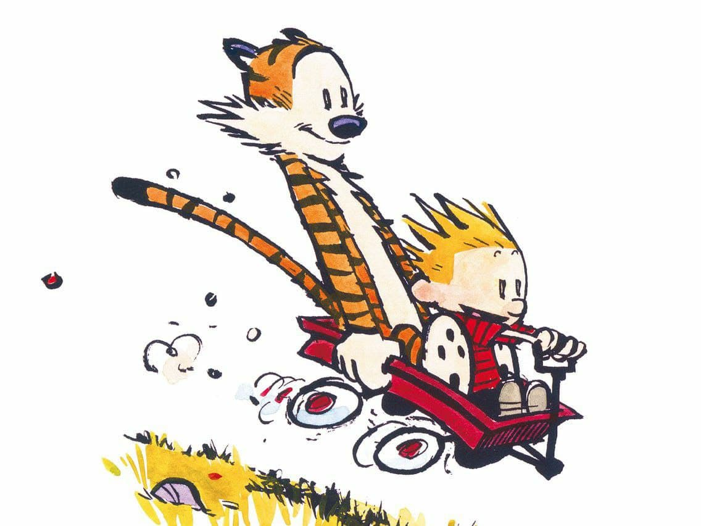
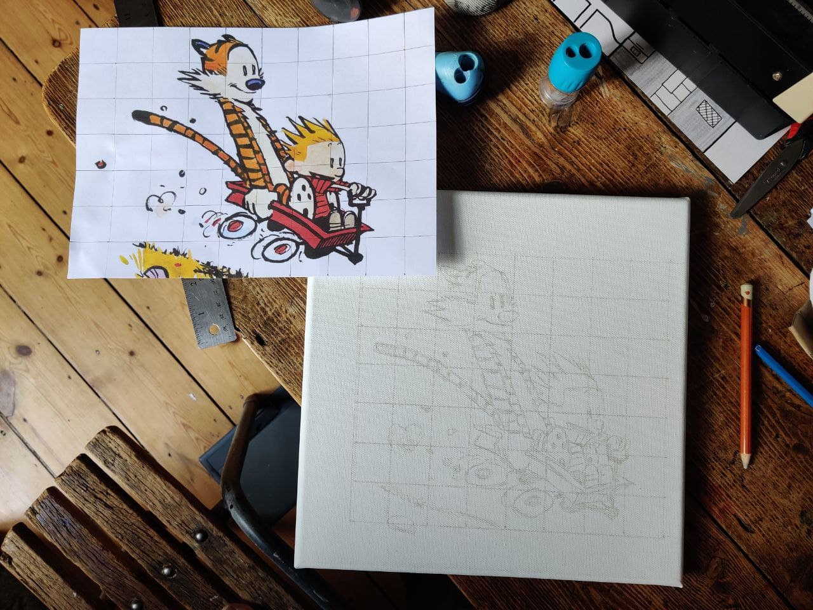
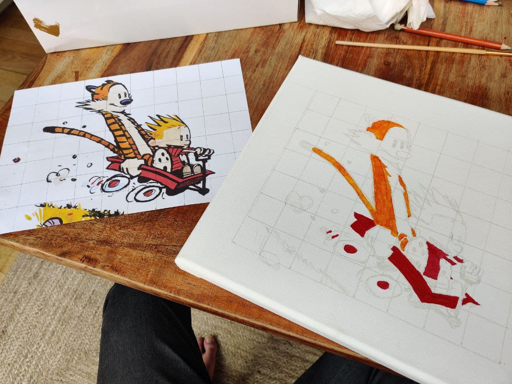
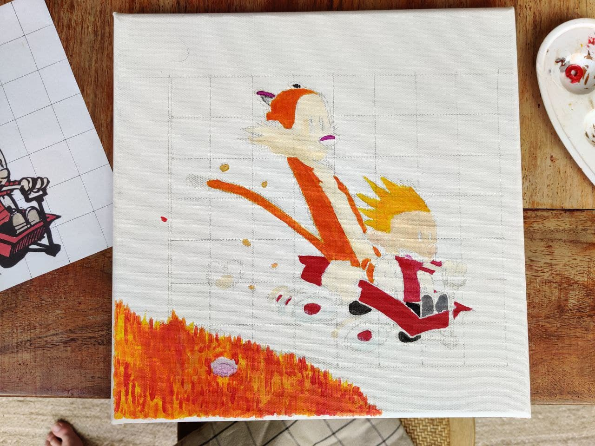
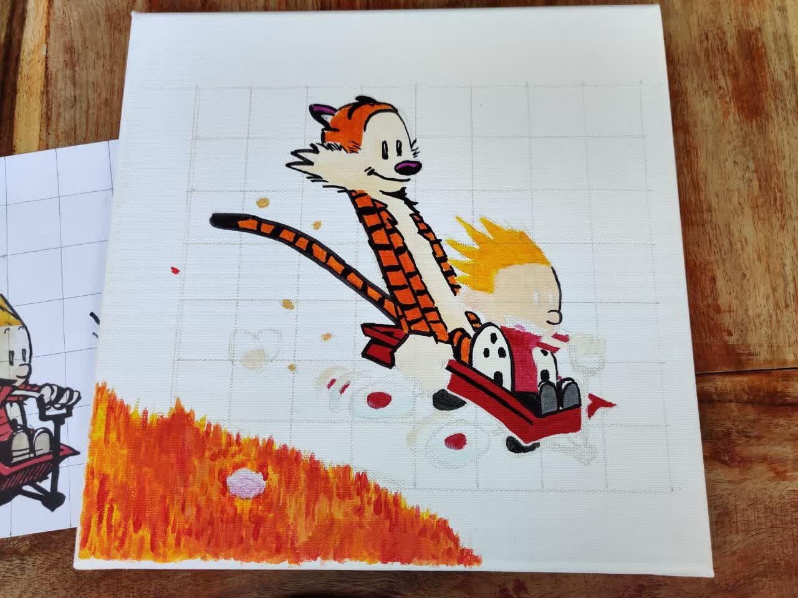
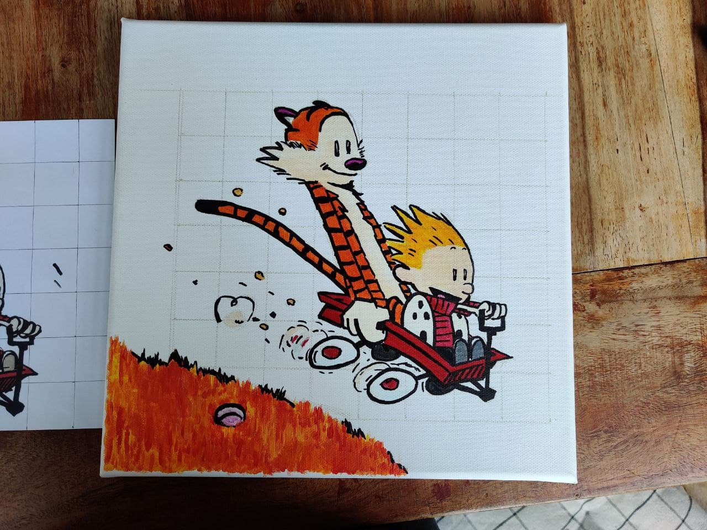

# Calvin and Hobbes Painting
Painting one of my favorite images of Calvin and Hobbes

*Jump to the bottom for the final result*

## 1. Base image

One of my favorite images of Calvin and Hobbes is this one where they are flying down a hill:

## 2. Sketching it up using a 3cm grid as a guide

Using a pencil that has is light enough so as to be able to erase the marks after and not have it see through on painted areas.

## 3. Testing the first colors

Trying out the first few strokes of paint so as to be sure they are correct. Since the colors is dark, I had to go put a second layer so as to make them pop.

## 4. Finishing up the colors

The lighter colors needed just one layer to really pop, such as Hobbes's fur and the light blue on the wheels.

## 5. Outlining

I used a ProMark marker for the outlining as paint wouldn't have given the same "Cartoon drawing" effect. It worked fantastic, and gives a really nice black instead of a greyed out marker trace I was worrying I would get

## 6. Final product

After around 3 hours of sweat and patience, the painting is done and all I needed was to wait a few hours to let the paint dry so as to go in with an eraser for the grid lines.

